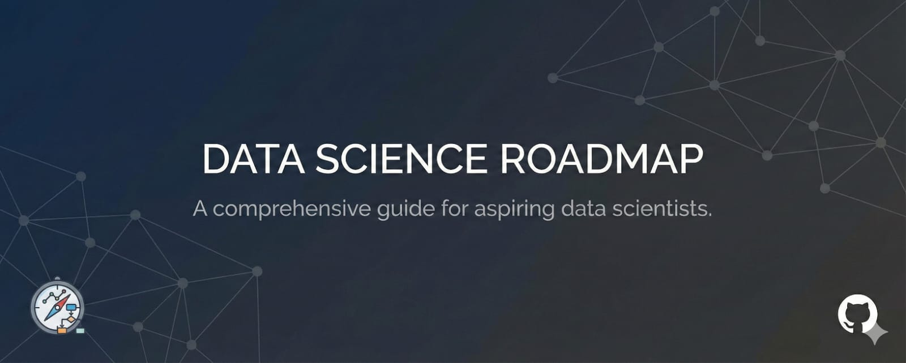

  

   

This repository contains structured, beginner-friendly notes that cover the essential building blocks of Python-based Data Analysis and Data Science fundamentals.
It is designed as a clean reference guide for learners, students, and anyone revising core concepts.

📂 Topics Covered
1️⃣ Python Libraries for Data Analysis
NumPy

Array creation, indexing, slicing

Vectorized operations & broadcasting

Mathematical, random, and statistical utilities

Pandas

DataFrames, Series, indexing

Cleaning, transforming, and summarizing data

GroupBy, merging, concatenation

Handling categorical and numeric features

Matplotlib & Seaborn

Basic plotting and customization

Distribution plots, scatter plots, boxplots

Heatmaps, pairplots, and styling

🆕 Newly Added Modules
2️⃣ Statistics Basics

Measures of central tendency

Variability: variance, standard deviation

Understanding normal distribution, skewness & kurtosis

3️⃣ Handling Missing Values

Detecting missing data

Mean/median/mode imputation

Forward/backward fill

Removing null-heavy features

4️⃣ Handling Outliers

Identifying outliers visually and statistically

IQR rule

Z-score method

5️⃣ Encoding Techniques

Label Encoding

One-Hot Encoding

Frequency Encoding

Target Encoding

When to apply each and common pitfalls

6️⃣ Scaling Techniques

Min-Max Scaling

Standardization

Robust Scaling

Why scaling matters in ML and EDA

🧭 Full Data Analysis Workflow (Included in Notes)

🔹 Understanding the dataset
🔹 Cleaning and preprocessing
🔹 Handling missing values & outliers
🔹 Encoding categorical data
🔹 Scaling numerical features
🔹 Exploratory Data Analysis (EDA)
🔹 Preparing data for modeling

🎯 Purpose of This Repository

Build a strong foundation in data analysis

Provide revision-friendly structured notes

Help beginners understand “why” each step matters

Serve as a reference for projects and interviews

🤝 Contributions

Suggestions, improvements, or corrections are welcome.
Feel free to open an issue or submit a pull request.

⭐ Support

If this repository helps you, please consider giving it a star to support the work.
