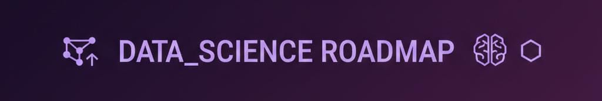

  
  
  
  

# 📊 Data Science Roadmap

A structured, end-to-end **Data Science learning roadmap** covering **Data Analysis, Machine Learning, Natural Language Processing, and Deep Learning**, designed for beginners to intermediate learners who aim to build **strong fundamentals with practical depth**.

This repository follows a **week-wise and topic-wise progression**, starting from core Python and data analysis, advancing through classical machine learning, and extending into NLP and deep learning concepts.

---

## 🚀 What This Repository Covers

### 1️⃣ Data Analysis Foundations
Build a strong base in data handling, visualization, and statistics.

- Python for Data Science  
- NumPy  
- Pandas  
- Data Cleaning & Handling Missing Values  
- Encoding Techniques & Feature Scaling  
- Matplotlib & Seaborn  
- Exploratory Data Analysis (EDA)  
- Descriptive Statistics & Probability  

---

### 2️⃣ Machine Learning (Core to Advanced)
Step-by-step progression from fundamental algorithms to powerful ensemble models.

- Linear Regression  
- Logistic Regression  
- K-Nearest Neighbors (KNN)  
- Naive Bayes  
- Decision Trees  
- Random Forest  
- Support Vector Machines (SVM)  
- Gradient Boosting  
- **XGBoost**

Each topic focuses on:
- Conceptual clarity
- Mathematical intuition (where required)
- Python implementation
- Model evaluation and performance metrics

---

### 3️⃣ Natural Language Processing (NLP)
Covers practical NLP workflows used in real-world applications and interviews.

- Text Cleaning & Preprocessing  
- Tokenization  
- Stopword Removal  
- Lemmatization & Stemming  
- Bag of Words (BoW)  
- **TF-IDF**
- Text Feature Engineering  
- End-to-End NLP Pipelines  

---

### 4️⃣ Deep Learning (Foundations to Applied Concepts)
Introduces deep learning fundamentals with a focus on understanding how modern neural models work.

- Introduction to Neural Networks  
- Perceptron & Multilayer Perceptron (MLP)  
- Activation Functions  
- Loss Functions & Optimization  
- Forward & Backpropagation  
- Gradient Descent Variants  
- Overfitting, Underfitting & Regularization  
- Basics of Deep Learning Frameworks (TensorFlow / PyTorch)
- Applications in:
  - Computer Vision
  - Natural Language Processing
  - Tabular Data Modeling

---

## 🗂 Repository Structure

---

## 🎯 Who This Roadmap Is For

- Beginners starting Data Science from scratch  
- Students preparing for **placements & technical interviews**  
- Self-learners seeking a **clear, structured learning path**  
- Aspiring ML / NLP / Deep Learning practitioners  

---

## 🧠 Learning Philosophy

- Fundamentals before complexity  
- Concepts before implementation  
- Mathematical intuition where necessary  
- Interview-oriented understanding  
- Reusable, real-world knowledge  

---

## 🛠 Tech Stack

- Python  
- NumPy  
- Pandas  
- Matplotlib & Seaborn  
- Scikit-learn  
- XGBoost  
- NLP Libraries (NLTK / spaCy)  
- Deep Learning Frameworks (TensorFlow / PyTorch)

---

## 📌 How to Use This Repository

1. Follow topics **sequentially**
2. Revise theory before coding
3. Experiment with the provided implementations
4. Take notes alongside practice
5. Revisit ML, NLP, and DL sections for reinforcement

---

## 📈 Roadmap Vision

This repository is designed to evolve into a **complete Data Science learning hub**, including:
- Advanced Deep Learning concepts
- End-to-end projects
- Interview preparation material
- Model deployment basics

---

## 🤝 Contributions

Suggestions and improvements are welcome.  
Feel free to fork this repository and adapt it to your learning journey.

---

## ⭐ Acknowledgment

If you find this roadmap helpful, consider giving it a ⭐  
Happy Learning! 🚀
